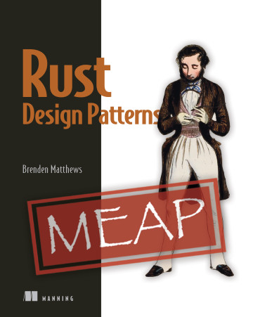

# Practice Book: Brenden Matthews: Rust Design Patterns

This repository contains my practical exercises from the upcomming book [«Rust Design Patterns» by Brenden Matthews (Manning)](https://www.manning.com/books/rust-design-patterns).

The original code repository is located [here in GitHub](https://github.com/brndnmtthws/rust-design-patterns-book).

## License

[MIT](https://choosealicense.com/licenses/mit/)

The original copyright belongs to [Manning Publications Co](https://www.manning.com/).

Matthews, Brenden. 2024. Rust Design Patterns. Manning Publications. ISBN: 9781633437463